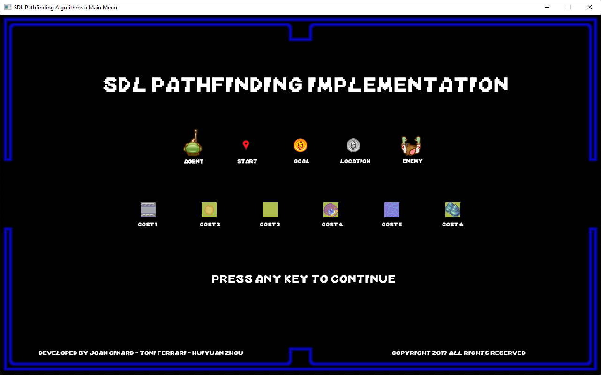

# C++ SDL Artificial Intelligence Pathfinding

C++ artificial intelligence pathfinding algorithm's implementation following the book "Artificial Intelligence for Games" by Ian Millington and John Funge.

  
  
  
  
  
  

The following keys open the following scenes:

- ## Key 0: Main Menu

- ## Key 1: Breadth First Search

- ## Key 2: Dijkstra's Algorithm

- ## Key 3: Greedy Breadth First Search

- ## Key 4: A* Algorithm

- ## Key 5: A* Algorithm with N Locations

- ## Key 6: A* Algorithm with N Enemies

